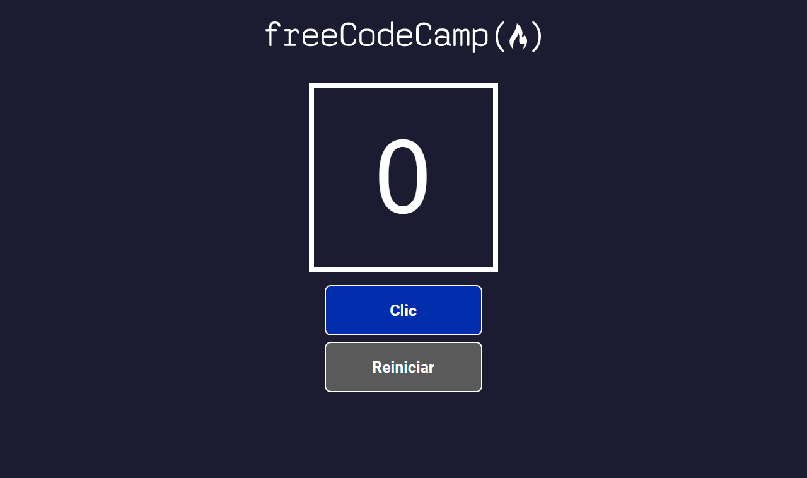

# 🧮 App de Contador en React


Aplicación minimalista creada con **React** como parte de un curso introductorio.
Incluye un contador funcional, un botón para incrementarlo y un botón para reiniciarlo, construidos mediante **componentes reutilizables** y gestionados con el hook **useState**.

---

## 📸 Vista previa


 ``

```


```

---

## 🚀 Tecnologías utilizadas

* **React**
* **JavaScript (ES6+)**
* **JSX**
* **CSS**
* **Hooks (useState)**

---

## 🎯 Objetivo del proyecto

Este ejercicio está pensado para practicar conceptos fundamentales:

* Componentes funcionales
* Componentes reutilizables (Botón, Contador)
* Manejo del estado con **useState**
* Eventos y actualización del estado
* Diseño limpio y minimalista

---

## ⚙️ Funcionalidades

* ➕ **Incrementar el contador**
* 🔄 **Reiniciar el contador**
* 🧩 Botones reutilizables
* 🔢 Componente contador independiente
* 📱 Diseño simple y adaptable

---

## 📁 Estructura del proyecto

```plaintext
src/
 ├── components/
 │    ├── Boton.jsx
 │    └── Contador.jsx
 ├── App.jsx
 ├── App.css
 └── index.js
```

---

## 📦 Instalación y uso

```bash
# Instalar dependencias
npm install

# Iniciar el servidor de desarrollo
npm start
```

La app estará disponible en:
👉 **[http://localhost:3000](http://localhost:3000)**

---

## ✨ Estado del proyecto

Ejercicio básico, centrado en reforzar el uso de **useState**, los componentes reutilizables y la estructura esencial de una app en React.

---

## 📝 Licencia

Este proyecto es de código abierto bajo la licencia **MIT**.

---

[](https://github.com/AlexandraFerrera)

